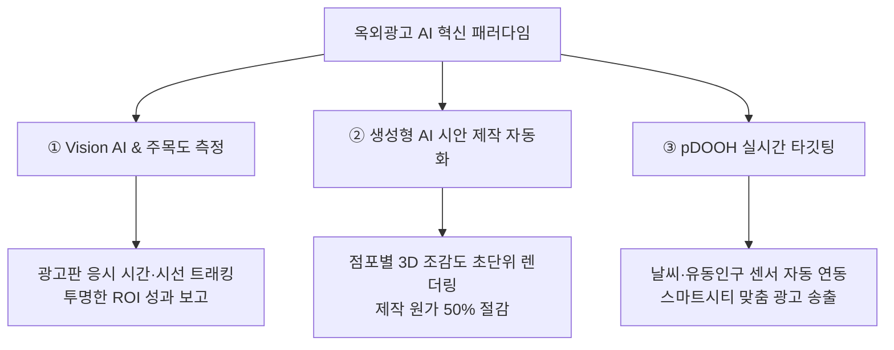

*▲ 사진 설명: 첨단 인공지능(AI)과 컴퓨터 비전 기술이 결합되어 실시간 인터랙티브 미디어로 진화하는 옥외광고 산업*

대한민국 옥외광고 산업의 대표 정론지인 **《한국옥외광고신문》 2026년 9월 2일자 전면 톱기획**에 따르면, 국내 옥외광고 및 사인물 제작·매체 업계가 **'본격적인 인공지능(AI) 시대 대응'**에 총력을 기울이며 산업의 패러다임을 통째로 바꾸고 있습니다.

과거 단순한 철골 구조물과 조명 간판, 일방향 동영상 재생에 머물렀던 옥외광고는 이제 **'Vision AI 기반 주목도 정밀 측정'**, **'생성형 AI 디자인 자동화'**, 그리고 **'초개인화 실시간 프로그래매틱 DOOH(pDOOH)'**가 융합된 첨단 애드테크(AdTech) 산업으로 재편되고 있습니다.

오늘 SignBid 인사이트에서는 《한국옥외광고신문》이 보도한 옥외광고 AI 혁신의 3대 축과, 옥외광고 사업자가 조달청 나라장터 공공입찰 및 민간 수주전에서 승리하기 위한 실전 대응 전략을 총정리해 드립니다.

---

## 1. 🔍 《한국옥외광고신문》이 조명한 옥외광고 AI 3대 혁신 흐름

### ① '추정치'에서 '정밀 데이터'로: Vision AI 기반 효과 측정 표준화
기존 옥외광고의 가장 큰 한계는 "과연 몇 명이 이 간판을 실제로 보았는가?"에 대한 객관적 데이터를 제시하기 어렵다는 점이었습니다.
* **컴퓨터 비전(Vision AI) 카메라:** 전광판 앞을 지나가는 보행자의 단순 이동 인구뿐만 아니라, **실제로 화면을 바라본 시간(Dwell Time)과 시선 체류 각도(Attention Rate)**를 익명화된 데이터로 실시간 분석합니다.
* **효과지표 표준화 얼라이언스:** 국내 35개 유관 기관 및 학계가 참여하여 AI 기반 DOOH 광고 효과 측정 지표를 공식 표준화함으로써, 공공기관과 대형 광고주의 신뢰도가 비약적으로 상승했습니다.

### ② 생성형 AI(Generative AI)를 활용한 디자인·3D 렌더링 혁신
* **초단위 3D 시뮬레이션:** 과거 수일이 소요되던 지자체 청사 간판 및 3D 아나몰픽 미디어아트 시안 제작이 생성형 AI 툴(Midjourney, Stable Diffusion, Unreal AI 파이프라인)을 통해 **현장 사진 입력 즉시 고화질 3D 합성 시안으로 자동 렌더링**됩니다.
* **영업 제안 속도 극대화:** 점포주와 지자체 담당자 미팅 현장에서 즉석으로 맞춤형 디자인을 시연함으로써 수주 계약 성사율이 2배 이상 증가했습니다.

### ③ pDOOH와 통신사 빅데이터 기반 동선 타깃팅
* **피치에이아이(P2ACH AI), 애드(addd)** 등 국내 옥외광고 AI 전문 스타트업들이 급성장하며, 네이버 등 대형 포털 플랫폼과 결합한 온·오프라인 통합 마케팅이 현실화되었습니다.
* 출퇴근 시간대 직장인 밀집 구역에는 맞춤형 금융·생활 광고가, 주말 관광지에는 로컬 축제 및 맛집 정보가 초 단위로 자동 입찰되어 송출됩니다.

---

## 2. 🏛️ 공공입찰(나라장터) 수주를 위한 사업자 실전 대응 체크포인트

지자체와 공공기관의 스마트 전자게시대, 청사 미디어월, 관광지 스마트 키오스크 발주 시방서에 AI 요구 조건이 대거 추가되고 있습니다. 옥외광고 사장님들이 반드시 준비해야 할 3대 전략은 다음과 같습니다:

### ① 제안서 정성평가에 'AI 안전 관제 및 조도 제어' 명시
* **야간 빛공해 방지 자동 디밍(Auto-Dimming):** 일몰/일출 시각 및 기상 센서와 연동하여 표면 밝기를 자동 조절하는 AI 센서 제어기를 규격서에 포함해야 합니다.
* **AI 화재·발열 사전 예지보전:** 전광판 모듈의 이상 발열을 24시간 자율 감시하고 관리자에게 카카오 알림톡을 발송하는 안전 관리 체계를 강조하세요.

### ② 소프트웨어 전문기업과의 '공동수급(컨소시엄)' 체결
* 하드웨어 직접생산확인(간판, 안내전광판)을 보유한 옥외광고 기업이 CMS 및 Vision AI 솔루션을 보유한 IT 소프트웨어 기업과 **분담이행방식 공동수급체**를 구성하면 기술능력평가에서 만점을 획득할 수 있습니다.

### ③ 직접생산확인 및 AI 융합 인증 관리
* 중소기업유통센터(SMPP)에서 관리하는 직접생산확인 기준 외에도 **KC 인증, 고효율 에너지기자재 인증, GS(Good Software) 1등급 소프트웨어 탑재 확인서**를 사전 구비해 두어야 합니다.

---

## 💡 옥외광고 사장님들이 가장 많이 묻는 실무 Q&A

**Q1. 전통 간판 제작사도 AI 기술을 도입할 수 있나요?**  
**A.** 물론입니다! 간판의 기본 프레임 가공 시 AI 기반 레이저/CNC 네스팅(Nesting) 소프트웨어를 도입하면 자재 로스율을 15% 이상 줄일 수 있으며, 생성형 AI를 활용한 고객 시안 제작은 별도의 고가 장비 없이도 바로 적용할 수 있습니다.

**Q2. 《한국옥외광고신문》에 소개된 AI 효과측정 장비를 공공 전광판에 설치해도 개인정보보호법에 위반되지 않나요?**  
**A.** Vision AI 솔루션은 보행자의 얼굴 사진이나 개인정보를 서버에 저장하지 않고, 현장에서 즉시 **익명화된 메타데이터(연령대 추정치, 시선 체류 초 단위 수치)**로만 변환 처리하므로 개인정보보호법 및 국가정보원 가이드라인을 완벽히 준수합니다.

---

## 📚 자료 출처 및 공식 원문 링크 (Sources & References)

본 분석 기사에 활용된 공식 언론 보도 및 공인 기관의 출처는 다음과 같습니다:

1. **📰 《한국옥외광고신문(KOAA)》**: 2026년 9월 2일자 전면 특집 — "옥외광고업계도 본격적인 AI 시대 대응에 분주" ([한국옥외광고신문 바로가기](https://koaa.or.kr))
2. **🏢 한국옥외광고협회중앙회**: 옥외광고 산업 진흥 및 AI 기반 신기술 교육 가이드 ([협회 공식 웹사이트](https://koaa.or.kr))
3. **🏛️ 조달청 나라장터 (G2B)**: 공공기관 디지털 사이니지·전자게시대 발주 규격 및 직접생산확인 기준 ([나라장터 바로가기](https://www.g2b.go.kr))
4. **🏢 한국지방재정공제회 한국옥외광고센터**: 옥외광고 효과지표 표준화 및 산업 통계 ([한국옥외광고센터 바로가기](https://ooh.or.kr))
5. **📰 월간 팝사인 (POPSIGN)**: 2026 옥외광고 AX(AI 전환) 기술 르포 ([팝콘텐츠 공식 사이트 바로가기](http://www.popsign.co.kr))
6. **📸 이미지 출처**: Tara Winstead on Pexels (공인 크리에이티브 라이선스)

---

> **※ 기사 및 리포트 안내:** 본 기사는 각 정부 부처, 공공기관 및 전문 언론사의 공식 보도자료와 공개 데이터를 바탕으로 작성된 분석 리포트입니다. 법령 개정 및 세부 정책 일정은 행정기관의 사정에 따라 변동될 수 있으므로, 관련 업무 추진 시 소관 부처의 공식 고시 및 원문 자료를 최종 확인하시기 바랍니다.
