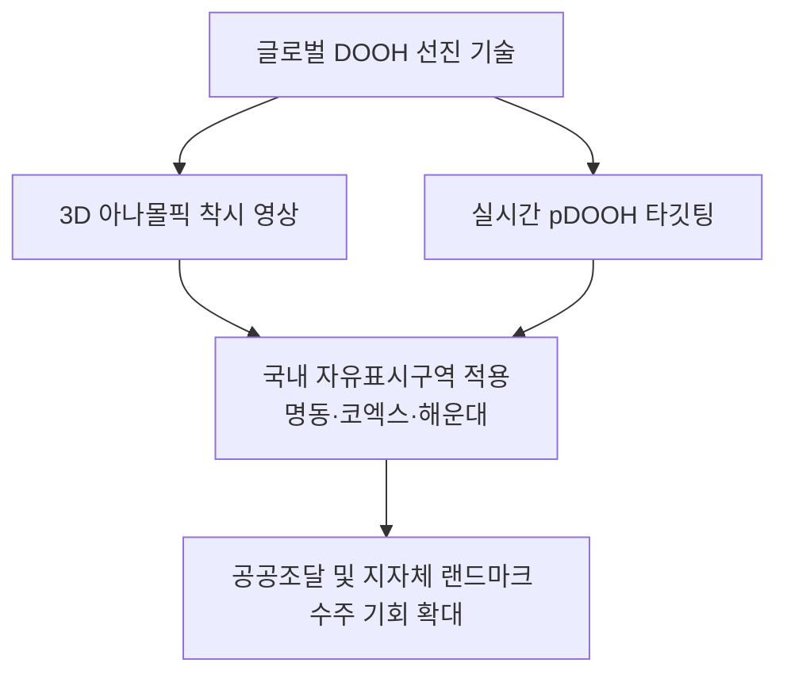

전 세계 옥외광고 시장이 아날로그 빌보드를 넘어 **'초대형 3D 아나몰픽 착시 미디어'**와 **'빅데이터 기반 실시간 프로그래매틱 DOOH(pDOOH)'**로 완벽하게 전환되고 있습니다.

뉴욕 타임스스퀘어, 런던 피카딜리 서커스, 도쿄 신주쿠의 랜드마크 전광판들은 이제 단순한 브랜드 노출 매체가 아니라, **시민들이 스마트폰으로 촬영해 SNS에 자발적으로 공유하는 '도시의 핫플레이스 미디어아트 공간'**으로 자리 잡았습니다.

오늘 9월 11일 오후 SignBid 글로벌 인사이트에서는 **세계옥외광고협회(World Out of Home Organization, WOO)**의 최신 글로벌 리포트를 바탕으로, 국내 옥외광고 사업자와 지자체 담당자가 주목해야 할 **해외 선진 트렌드와 국내 공공·민간 조달 수주 로드맵**을 심층 분석합니다.

---

## 1. 🌐 글로벌 시장을 뒤흔든 2대 혁신 키워드

### ① 화면을 뚫고 나오는 시각적 충격: '3D 아나몰픽(Anamorphic) 일루전'
특정 시점(Point of View)에서 바라보았을 때 평면 화면이 입체 공간처럼 느껴지도록 착시를 유도하는 **3D 아나몰픽 기술**은 전 세계 DOOH 시장의 표준이 되었습니다.
* **성공 사례:** 나이키(Nike) 에어맥스 3D 팝업 영상, 삼성전자 갤럭시 Z 폴드 글로벌 옥외광고 캠페인
* **핵심 효과:** 일반 2D 전광판 대비 **보행자 시선 체류 시간(Dwell Time) 3.8배 증가**, SNS 바이럴 영상 생성률 5배 이상 급증

### ② 원하는 순간 타깃 고객에게만 자동 송출: 'pDOOH (Programmatic DOOH)'
글로벌 옥외광고 시장에서 가장 빠르게 성장하는 분야는 단연 **pDOOH**입니다.
* 전광판에 탑재된 스마트 센서가 **시간대별 유동인구, 날씨(온도·강수), 주변 교통 혼잡도** 데이터를 실시간 측정합니다.
* 비가 올 때는 우산 및 배달앱 광고가, 퇴근 시간대 직장인 밀집 지역에는 주류 및 OTT 콘텐츠 광고가 **초 단위로 자동 입찰(Real-Time Bidding)되어 송출**됩니다.

---

## 2. 🏛️ 국내 옥외광고물 자유표시구역과의 연계 및 시사점

대한민국 정부와 행정안전부 역시 옥외광고 산업의 디지털 대전환을 위해 **'제2기 및 제3기 옥외광고물 자유표시구역'**(서울 명동, 광화문, 부산 해운대 등)을 신규 지정하고 규제를 대폭 완화했습니다.

### 옥외광고 제작사가 준비해야 할 실무 경쟁력 3요소:
1. **곡면(Curved) 및 코너형 초고밀도 LED 캐비닛 시공 역량:** 아나몰픽 입체감을 극대화하기 위해 90도 코너 심리스(Seamless) 베젤리스 시공 기술이 필수적입니다.
2. **생성형 AI 기반 3D 그래픽 파이프라인 구축:** Blender, Unreal Engine과 비디오 생성 AI를 결합하여 3D 렌더링 비용을 획기적으로 낮추는 기술이 제안서 평가의 승부처가 됩니다.
3. **KOLAS 공인 시험성적서 기반의 야간 눈부심 방지 설계:** 빛공해방지법 및 지자체 경관조례를 준수하는 자동 감광(Auto-Dimming) 제어기를 일체화해야 합니다.

---

## 💡 옥외광고 사장님들이 가장 많이 묻는 질문 (FAQ)

**Q1. 중소기업도 3D 아나몰픽 사이니지 공공입찰에 참가할 수 있나요?**  
**A.** 네, 충분히 가능합니다. 하드웨어 외함 및 LED 모듈 직접생산확인을 보유한 옥외광고 업체가 3D 미디어아트 전문 디자인 스튜디오와 **공동수급체(분담이행방식)**를 구성하여 참여하는 방식이 공공입찰에서 매우 높은 기술점수를 얻고 있습니다.

**Q2. 해외 pDOOH 솔루션을 국내 공공 전광판에 도입할 때 보안 규제는 없나요?**  
**A.** 공공기관 전광판은 국가정보원 보안 가이드라인 및 지자체 전산망 보안 인증을 통과해야 하므로, 국내 공인 인증(KCMVP)을 받은 보안 모듈 및 CMS 소프트웨어를 연동해야 합니다.

---

## 📚 국내외 공식 출처 및 원문 레퍼런스 (Sources & References)

본 분석에 활용된 글로벌 공인 협회 및 정부 부처의 공식 출처는 다음과 같습니다:

1. **🌐 세계옥외광고협회 (World Out of Home Organization)**: 2026 Global Programmatic & DOOH Growth Trends ([공식 웹사이트 바로가기](https://worldooh.org))
2. **🏛️ 행정안전부 (MOIS)**: 옥외광고물 자유표시구역 지정 및 관리 지침 고시 ([행정안전부 바로가기](https://www.mois.go.kr))
3. **🏢 한국지방재정공제회 한국옥외광고센터**: 옥외광고 산업 실태조사 및 디지털 사이니지 통계 ([한국옥외광고센터 바로가기](https://ooh.or.kr))
4. **🏛️ 조달청 나라장터 (G2B)**: 공공기관 디지털 전광판 및 미디어파사드 발주 규격 ([나라장터 바로가기](https://www.g2b.go.kr))
5. **📰 월간 팝사인 (POPSIGN)**: 글로벌 DOOH 인터랙티브 광고 제작 사례 ([팝콘텐츠 공식 사이트 바로가기](http://www.popsign.co.kr))

---

> **※ 기사 및 리포트 안내:** 본 기사는 각 정부 부처, 공공기관 및 전문 언론사의 공식 보도자료와 공개 데이터를 바탕으로 작성된 분석 리포트입니다. 법령 개정 및 세부 정책 일정은 행정기관의 사정에 따라 변동될 수 있으므로, 관련 업무 추진 시 소관 부처의 공식 고시 및 원문 자료를 최종 확인하시기 바랍니다.
